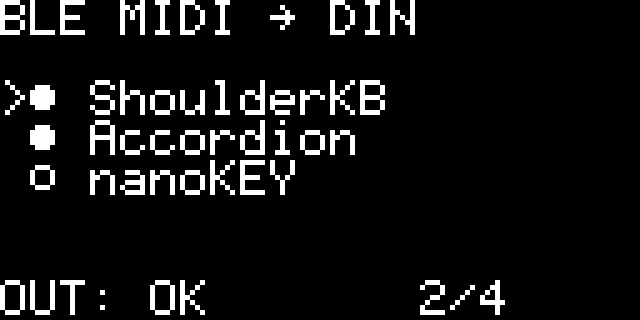
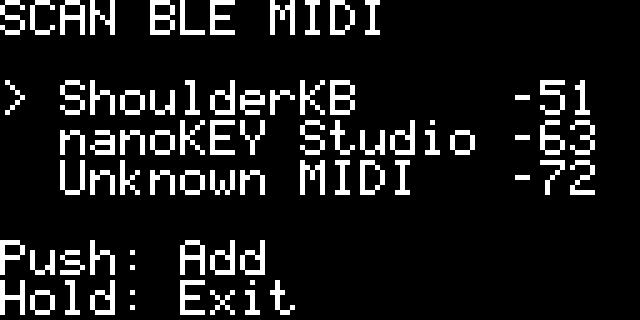

# BLE MIDI → DIN — 0.5.0 Serial Console

ESP32-SOLO-1 / SSD1306 128×64向け。登録一覧、SCAN画面、ロータリーエンコーダの操作、NVS登録保存、登録機器の自動接続を追加しています。登録は最大4台、BLE接続枠も4台です。

## 表示と操作

通常画面の記号は **● 接続済み、○ 登録済み・未接続、… 接続中、! 接続エラー**。`>`が選択位置です。3行を超える一覧は、選択に合わせて表示範囲が切り替わります。下段の`2/4`は「接続済み2台／登録4台」で、実際の件数を表示します。

- 回す：前後の機器を選択。
- 短押し：選択機器を接続／切断。接続処理中はキャンセル。
- 1.5秒長押し：SCAN画面へ。SCAN中の長押しは通常画面へ戻る。
- SCAN中の短押し：選択したBLE MIDI機器を登録し、接続を試みる。既存登録なら重複追加しない。

SCAN画面には機器名と発見時のRSSIを表示します。RSSIは連続更新しません。名前が取れない機器は`Unknown MIDI`です。エンコーダのボタンは20msのチャタリング除去、長押し後の離し操作では短押しを発生させません。





表示例は実際の描画コードで生成したもので、実機の写真ではありません。

## 起動と登録保存

電源ON → NVSの登録一覧を復元 → 登録機器をスキャン → 発見した機器から順に接続 → 通知購読を有効化。未登録機器へ勝手に接続しません。未登録状態で起動した場合はSCAN画面を開きます。

以前の1台分の保存情報は登録一覧へ移行します。登録一覧は`midi_peer`名前空間の`registry`キーへ保存。NVS書き込みはMIDI通知コールバックで行わず、別の低優先度タスクで500msの無通信とUART送信完了を待って行います。`Saving...`中は保存待ちのため、電源を切らず、表示が消えるのを待ってください。保存失敗は`SAVE ERROR`で表示します。起動ごとの不要な保存は行いません。

短押しで切断した機器は、その起動中の自動再接続を止めます。短押しで接続を再開でき、次回電源ONでは再び自動接続対象になります。予期しない切断では復旧スキャンを表示より先に開始します。失敗後は3秒間の再試行待ちを設け、機器が広告を再開すれば再接続を試みます。

PublicアドレスとRandom Staticアドレスはアドレスで照合します。Private Address機器は保存した非空の名前が一意の場合に名前で照合します。これはIRKによるIdentity解決ではなく、同名機器や名前を広告しない機器では確実な識別を保証できません。名前のないPrivate Address機器の登録は`NAME REQUIRED`として拒否します。

## 配線

| 用途 | ESP32 GPIO |
|---|---:|
| OLED SDA / SCL | 21 / 22 |
| エンコーダ A / B | 32 / 33 |
| エンコーダ押しボタン | 27 |
| UART MIDI OUT | 17 |
| BLE受信／UART投入の測定マーカー | 25 / 26 |

エンコーダA/Bの共通端子と押しボタンの共通端子はGNDへ。入力は内部プルアップを使用します。電源が必要なエンコーダ基板では、GPIOへ3.3Vを超える信号を入れないでください。OLEDはSSD1306、I²C 0x3C、400kHzです。

GPIOは`components/app_config/include/config.h`で変更できます。回転方向が逆ならA/Bを入れ替えます。

## MIDIとOLEDの優先順位

MIDI通知→パーサ→UARTの経路に、OLED処理・NVS書き込み・エンコーダ処理を入れていません。UARTは31250 baud。OLEDはイベント時だけ更新し、各転送の前に50msの無通信とUART完全空を確認します。画面は16 byteずつ差分転送し、UART IRQ Level2 / I²C Level1、転送間隔2msを維持しています。継続演奏中は、ボタンを操作しても表示だけが保留されることがあります。

`OUT: OK`はUART出力が初期化済みであることを示します。DINケーブル、外部回路、受信機を電気的に検出した表示ではありません。

複数入力の短いMIDIメッセージとRealtimeは同じDIN出力へマージします。1本のDIN上でSysExを重ねることはできないため、別入力の通常メッセージや新しいSysExが届いた場合、進行中のSysExをF7で閉じ、残りを抑制します。演奏データを長いSysEx待ちにしない方針です。全入力の合計がDIN帯域を超える場合はバッファが溢れる可能性があります。接続要求CI7.5ms、latency0、timeout1sは維持しますが、4台接続時の実測遅延と安定性は未検証です。


切断時のSource別Note Off自動送信は未実装です。長いSysExの中断方針と同様に、複数機器で同じMIDIチャンネルを使用する場合の演奏上の扱いは、受信機側の構成も含めて確認が必要です。また、NVS書き込みが始まった直後に新しいMIDIが届く場合の遅延は未検証です。

## 検証の範囲

PCテストはパーサ、UARTキュー、OLEDフレーム、転送、機器判定、登録・入力、複数入力のマージの7群が合格しています。登録の重複・上限・復元データの妥当性、選択の周回、短押し・長押し・時刻の周回、競合SysExとRealtimeを確認しています。

実機の操作相当試験と復帰ログは同じフォルダーへ保存します。エンコーダは未接続のため、実際の接点・回転方向の確認は未実施です。mi.1からのMIDI通知停止とRP2040のUSBエラーは、このUI変更で解決したとは扱いません。

## ファームウェア

ビルド後の`build/ble_midi_din.bin`は通常版アプリケーション（0x10000）。`bootloader.bin`は0x1000、`partition-table.bin`は0x8000。既存環境へはアプリケーションだけ更新し、NVSを消去しないでください。この公開リポジトリはソース・設定の初期値・テスト・表示例を含みます。ビルド生成物、実機バックアップ、ローカルの測定ログは含みません。

## 今回の実機確認結果

ESP32のホストへボタン操作相当の命令を送り、8項目の検証が成功しました。旧登録の移行とNVS保存、起動時のmi.1接続、短押しで切断後に自動接続しないこと、SCANでmi.1を発見すること、既存登録を重複させず再接続すること、SCAN終了、再度の切断・手動再接続を確認。通常版へ戻した後の起動でもNVSから1台の登録を読み出し、自動接続が成功しています。エンコーダのGPIOは32/33/27として初期化済みですが、エンコーダ実機は未接続です。

今回の接続時もCI7.5ms、latency0、timeout1s、MTU23。OLED初期化のエラーやクラッシュはありません。通常版をESP32へ書き込み、ハッシュ検証済みです。試験用の自動ボタン操作は、現在のソースと通常版に残していません。実際の機器は1台なので、4台同時接続の実機試験は未実施です。外部MIDIデータやDIN回路を含む検証も未完了です。

実機・PC試験のログと集計は、配布フォルダー `BLE-MIDItoDIN-Device-UI` に保存しています。

## ソースからのビルド

ESP-IDF v6.1を使用します。Windows PowerShellの例：

```powershell
git clone https://github.com/tera-works/BLE-MIDItoDIN.git
cd BLE-MIDItoDIN
# ESP-IDF v6.1の環境を有効化してから実行
idf.py set-target esp32
idf.py build
idf.py -p COM7 flash
```

ターゲットはesp32、UNICORE、240MHz、4MB/DIO/40MHz。S3は対象外です。`sdkconfig`と`config.h`の双方で接続枠4台を設定しています。PCテストは`cmake -S test/host -B build-host`、`cmake --build build-host`、`ctest --test-dir build-host`で実行できます。

## BLE周期の位相測定とL2CAP更新（0.3.1）

7.5ms周期でRP2040の試験MIDI送信を位相スイープし、同じUART入力→UART出力開始の中央値が送信位相によって約2.6～9.6msへ変わる境界を観測。これは生成MIDIのペーシング試験で、鍵盤入力からの実測改善ではありません。実際のBLE無線anchorは取得しておらず、前回のUART出力を基準にしています。再取得と外れ値を含む試験も別途記録しています。

ESP-IDF v6.1のNimBLEソースを確認し、L2CAP更新要求が既存の7.5ms/latency0から長い周期へ変更する場合を拒否する処理を追加しました。L2CAPイベントにはself_paramsがないため、Link Layer更新要求とは分けて扱います。MIDI通知経路への待機は追加していません。実機接続は7.5msを確認、拒否対象の更新要求そのものは未観測です。

再接続後に通知0件となる症状は未解決です。今回、基板の電源再投入後は948件のCCが全件一致しましたが、ESP32再起動後に通知停止が再発しています。原因は基板内部状態と接続初期化の互換性を含めて未特定です。詳細な測定データと手順は配布フォルダー BLE-MIDI-Phase に保存しています。


## 登録の削除（0.4.0）
機器一覧で350ms以内に2回短押しすると、選択機器の削除確認を表示します。
初期選択はCancel。回してRemoveを選び、短押しで登録を削除します。
長押し1.5秒は確認を取り消します。確認画面とSCAN画面のダブルクリックは削除を実行しません。
1回目で接続/切断しないよう、単押しは離して350ms後に確定します。
接続中の削除では切断要求を先に行い、残りの登録番号も更新します。
NVSは低優先度ワーカーで保存します。Saving...が消えるまで電源を切らないでください。
Active Sensing単独の通知は保存の静穏判定から除外し、演奏データ後は500ms待ち、UARTが空のときに保存します。
最後の機器を削除した後は一覧が空になり、長押しでSCANへ入って再登録できます。


## シリアルモニタ（0.5.0）
USBのCOMポートを115200 baud・8N1・改行CR/LF/CRLFで開きます。UART0は操作とログ、UART1 GPIO17はDIN MIDI OUTです。

| コマンド | 動作 |
|---|---|
| help / ? | 操作一覧 |
| status | バージョン・接続・保存・MIDI件数・登録一覧 |
| list | 登録機器の番号・名前・状態・アドレス・CI・MTU |
| scan / scan on | SCAN画面へ入り、探索開始 |
| scan off | SCAN画面を終了（必要な自動再接続スキャンは継続） |
| found | 発見したBLE MIDI機器の番号とRSSI |
| connect N / disconnect N | listの番号を接続／切断 |
| add N | foundの番号を登録して接続 |
| remove N | listの番号の削除確認を表示、まだ削除しない |
| confirm / cancel | シリアルで確認中の機器を削除／取消 |
| log on / log off | 5秒ごとの統計ログを有効／停止 |

番号は1始まり。小文字の英語コマンドを使用します。remove後は対象のIdentityを保持し、別の操作で登録番号が変わっても別機器を削除しません。Ctrl+Cは入力行とシリアルでの削除確認を取消します。OLEDの削除確認とは別の確認です。
削除後のSaving...は保存待ちです。statusでsaving=noになってから電源を切ってください。
シリアル出力は低優先度タスクで行い、BLEホストで大量出力しません。状態確認はOLEDを更新しません。
log offは定期統計だけを止めます。接続イベント・エラーのログは引き続き表示します。

## 公開版の確認

ESP32-SOLO-1向けの0.5.0シリアルコンソール版です。公開時のソース確認・テスト結果は `docs/publication-verification.md` に記録します。OLED操作・接続履歴など上の各節は検証した時点の記録で、未検証事項を含みます。
